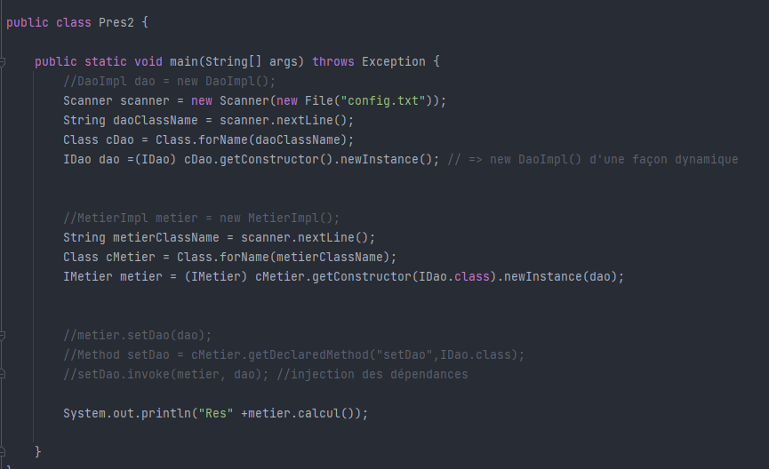
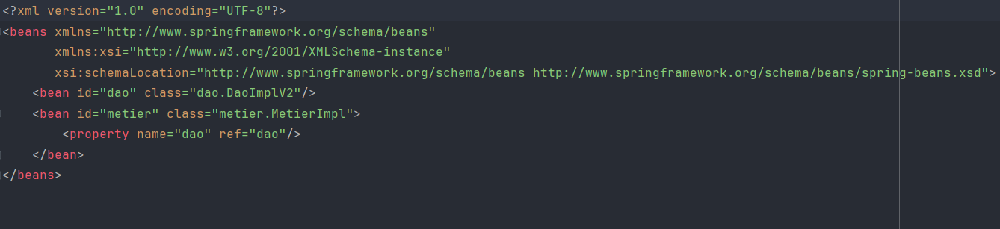

Realisée par : YOSRA MOUMTAZ

<h1 >Rapport de l'inversion de contrôle et l'injection des dépendances</h1>
<h2 style="color: cadetblue">Introduction</h2>

L'inversion de contrôle (IoC) est un concept qui permet de gérer les dépendances d'un objet 
sans que l'on ait à les instancier directement. Dans le contexte de la création des objets, 
Spring intervient pour injecter les dépendances entre les différents composants (appelés Beans) 
afin de s'assurer que toutes les relations requises sont établies.

Ce mécanisme permet aux développeurs de se concentrer davantage 
sur la logique métier de leur application, tandis que Spring prend en charge
l'injection des dépendances et offre diverses fonctionnalités techniques.

<h2 style="color: cadetblue">Ennoncé</h2>
<ol>
    <li>Couche DAO 
        <ul>
            <li>créer l'interface IDao</li>
            <li>créer une implémentation de l'interface IDao</li>
        </ul>
    </li>
    <li>Couche Métier
        <ul>
            <li>créer l'interface IMetier</li>
            <li>créer une implémentation de l'interface IMetier</li>
        </ul>
    </li>
    <li>Couche Présentation
        
Créer une application qui permet de faire l'injection des dépandences

        <ul>
        <li>Instantiation statique</li>
        <li>Instantiation dynamique</li>
        <li>En utilisant Spring Framework
            <ul>
                <li>version XML</li>
                <li>version Annotation</li>
            </ul>
        </li>
        </ul>
    </li>
</ol>
<h2 style="color: cadetblue">Conception</h2>
<h3>Principe du couplage faible</h3>

Lorsque nous visons à atteindre un couplage faible, l'utilisation d'interfaces est un élément essentiel. 
Pour illustrer cela, prenons en considération deux classes : `DaoImpl`, qui implémente l'interface `IDao`, 
et `MetierImpl`, qui implémente l'interface `IMetier`.

Lorsque la classe `MetierImpl` est associée à l'interface `IDao`, on peut dire que la classe 
`MetierImpl` et la classe `IDaoImpl` sont liées par un couplage faible.

Cela implique que la classe `MetierImpl` peut collaborer avec n'importe quelle classe qui respecte le contrat 
défini par l'interface `IDao`. En réalité, la classe `MetierImpl` n'a conscience que de l'existence 
de cette interface, ce qui signifie qu'elle peut être associée à n'importe quelle classe qui implémente 
cette interface, et ce, sans nécessiter de modifications dans la classe `MetierImpl`.

Le couplage faible permet ainsi de créer des applications qui sont résistantes aux modifications 
internes tout en étant flexibles pour les extensions.

<h2 style="color: cadetblue">Captures d'écrans</h2>
<h3>Création de l'interface IDao</h3>

<h3>Création d'une implémentation de l'interface IDao version Base de Données</h3>

<h3>Création d'une implémentation de l'interface IDao version web services</h3>

<h3>Création de l'interface IMetier</h3>

<h3>Création d'une implémentation de l'interface IMetier</h3>

<h3>Instantiation statique</h3>

<h3>Instantiation dynamique</h3>

<h3>Injection des dépendances en utilisant Spring version xml</h3>

On doit installer en premier lieu les dépandences, ensuite ajouter un fichier config.xml

<h3>Injection des dépendances en utilisant Spring version annotations</h3>

Repository Class

Service Class

Controller

